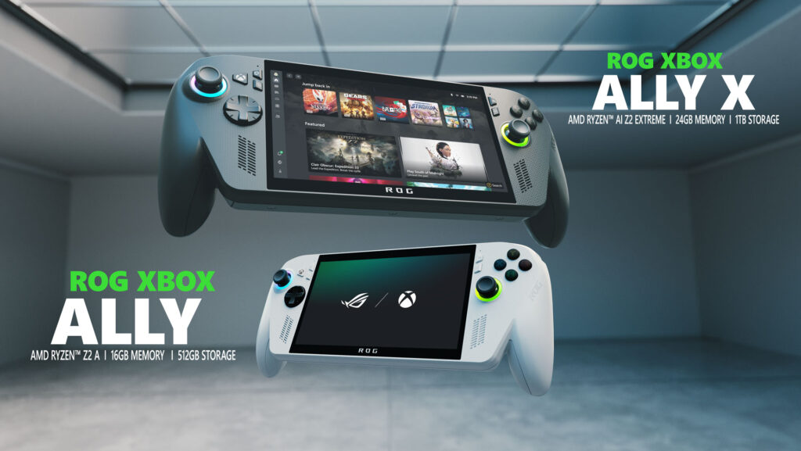
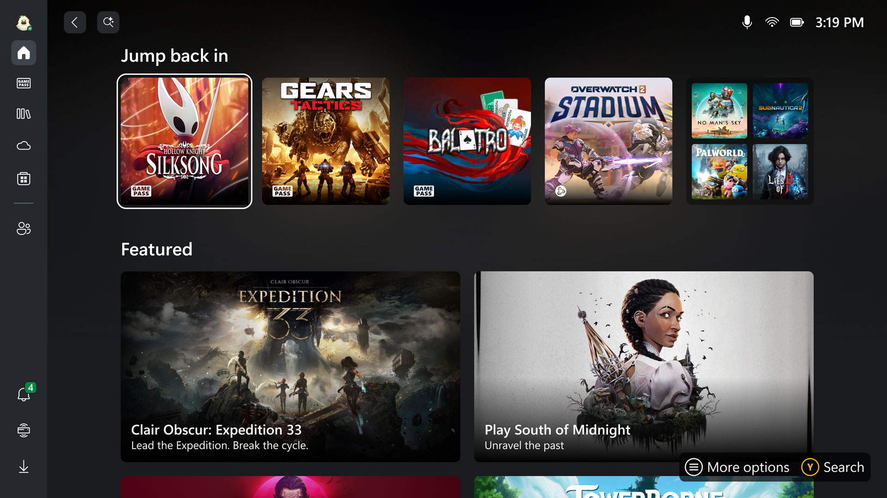

Microsoft [announced two versions of its new Xbox handheld](https://news.xbox.com/en-us/2025/06/08/xbox-handheld-rog-ally-x-games-showcase/) today at the Xbox Games Showcase 2025: The Xbox Ally and the Xbox Ally X. The released specifications for both models are as follows:

**Xbox Ally X Specification:**

|                  |                                 |
| ---------------- | ------------------------------- |
| Operating System | Windows 11 Home                 |
| CPU              | AMD Ryzen™ AI Z2 Extreme        |
| CPU Cores        | 8 Cores / 16 Threads (Zen 5)    |
| GPU Cores        | 16 (RDNA 3.5)                   |
| RAM              | 24GB LPDDR5X-8000               |
| Storage          | 1TB M.2 2280 SSD (Upgradable)   |
| Connectivity     | Wi-Fi 6E (2x2) + Bluetooth 5.4  |
| Weight           | 715g                            |
| Battery          | 80Wh                            |

**Xbox Ally Specification:**

|                  |                                 |
| ---------------- | ------------------------------- |
| Operating System | Windows 11 Home                 |
| CPU              | AMD Ryzen™ Z2 A                 |
| CPU Cores        | 4 Cores / 8 Threads (Zen 5)     |
| GPU Cores        | 8 (RDNA 2)                      |
| RAM              | 16GB LPDDR5X-6400               |
| Storage          | 512GB M.2 2280 SSD (Upgradable) |
| Connectivity     | Wi-Fi 6E (2x2) + Bluetooth 5.4  |
| Weight           | 670g                            |
| Battery          | 60Wh                            |

Comparing these to the specifications of the ROG Ally X, they just don't seem like a big upgrade. Even Jordan Gerblick from [Gamesradar](https://www.gamesradar.com/platforms/xbox/microsoft-insists-its-xbox-handheld-is-a-breakthrough-moment-but-it-kind-of-sounds-like-an-rog-ally-with-an-xbox-sticker-and-game-pass-to-me-it-looks-like-an-xbox-it-feels-like-an-xbox-it-plays-like-an-xbox/) said that "it kind of looks a lot like an Xbox-branded Asus ROG Ally."[^1]

The CPU and GPU improvements over the last generation don't seem significant. Especially for the base model, the Xbox Ally, with its AMD Ryzen™ Z2 A that look identical to the Zen 2 with it 4 cores 8 threads and 8 GPU cores on SteamDeck, which came out couple years ago. The only different is a higher configurable TDP (up to 20W versus the 15W on the Steam Deck). The Ryzen Z1 Extreme on the original ROG Ally is even more powerful. As for the Xbox Ally X, I expected the performance increase to be only about 5-10% from the original ROG Ally X.

According to [Android Authority](https://www.androidauthority.com/xbox-rog-ally-3565410/), "ASUS claims that playing in Silent Mode on the Xbox ROG Ally X will 'feel like' playing in Performance Mode on the previous Ally X while still offering more battery life."[^3] However, since I already use a battery pack with my original ROG Ally, the improved battery life might not matter much to me. I do want bigger battery like on the ROG Ally X, though, but that still doesn't seem like a worthwhile upgrade.

The most interesting addition is the dedicated NPU (Neural Processing Unit) in the new AMD Ryzen™ AI Z2 Extreme processor. This NPU, which provides up to 50 TOPS of AI compute power, could potentially benefit gaming by offloading tasks like [frame generation and upscaling](../../../../notes/tech/upscaling-technology.md), leaving the GPU to focus solely on graphics rendering. "Think of all the use cases that would blend AI based audio, AI-based gaming assisting functions, AI-based rendering capabilities," said AMD exec Sebastien Nussbaum[^5].

Personally, I think it's more toward AI-based gaming assisting functions by [Copilot for Gaming](https://news.xbox.com/en-us/2025/03/13/new-copilot-for-gaming-save-time-help-get-good/) than anything else. We will have to wait for performance tests on the final production units to see how this plays out.

The screen on the device is the same as previous generations. 7-inch 1080p 120Hz VRR. Many would want OLED screen, but ROG Ally team member Whitson Gordon explains that [they decided to go for VRR instead of OLED](https://www.purexbox.com/news/2025/06/asus-explains-why-the-rog-xbox-ally-doesnt-have-an-oled-screen) for the handheld devices:

> "We did look at OLED again this year, we did some R&D and prototyping with OLED, but it's still not where we want it to be when we factor VRR into the mix. And we aren't willing to give up VRR, I'll draw that line in the sand right now. I am of the opinion that if a display doesn't have Variable Refresh Rate, it's not a gaming display in the year 2025.
> 
> And OLED with VRR right now draws significantly more power than the LCD that we're currently using on the Ally, and it costs more."[^6]

I totally agree with their decision, as gaming on handheld devices still can't managed to get the frame rate as high and constant. I would prefer smooth gameplay with VRR over the color depth. Still, they should have slim down the bezel and increased the screen size.

## The New Xbox Game Launcher

What is really interesting is not on the hardware, but on the software side. While the device still runs Windows 11, when it is turned on, it will boot directly to a full-screen interface called the "Xbox Experience for Handheld," for which the Xbox team managed to integrated the code directly into the Windows branch. This interface hides the traditional Windows desktop by default, alongside minimizing background activity and deferring non-essential tasks to free up system resources, resulting in around 2 GB of RAM savings.[^2][^3] The ability to put the device to sleep mid-game and resume later is also said to be better implemented, hopefully achieving a seamless experience similar to the SteamOS.

Microsoft also plans to integrate the game libraries from other third-party stores (e.g., Steam, Epic Games Store, etc.). It would be great to be able to access all games from one launcher, according to The Verge:

> Microsoft demonstrated this handheld-friendly combination of Windows and Xbox to The Verge in a briefing earlier this week, but it was a virtual demo so we haven't been able to try it fully yet. It all starts by booting directly into a new Xbox full-screen experience on these ROG Xbox Ally devices that focuses on the Xbox app and Game Bar, alongside being a launcher for all your PC games — yes even Steam ones.[^4]

With that said, this is still Windows 11 at its core, and I expect that it will come with the mainline Windows updates that will be available on all devices, including the original [ROG Ally](../../../../notes/tech/rog-ally.md).

UPDATE: It is confirmed that the ["Xbox Full-Screen Experience" will be made available to other Windows handhelds in 2026](https://www.notebookcheck.net/Microsoft-says-the-ROG-Xbox-Ally-series-software-will-come-to-other-Windows-handhelds-in-2026.1032912.0.html).

## Might Not Be Worth the Upgrade

Seeing that the original ROG Ally was released on June 13, 2023, and the ROG Ally X was released on July 22, 2024, ASUS is following a pattern of releasing small spec bumps each year. If you just bought an ROG Ally device, it doesn't seem worthwhile to pay full price for a device that is not a significant update from the one you already have.

If you're don't already own one and looking to buy a ROG Ally, I recommend getting the new XBox Ally X, provided the price isn't much higher than the original. If I didn't already have the original, I would have gone for one myself.

What I would love to see in the next update to ROG Ally, and what would make me upgrade, is a bigger improvement to the screen. After seeing the Legion Go's 8.8-inch screen in person, I just want one. Even the Nintendo Switch 2 now has a 7.9-inch screen. Oh, and an actual touchpad on the device would be great, too. It would help a lot when playing older games that don't support controllers, as well as navigating the screen without needing to switch between Gamepad and Desktop modes.

## External Links

* [ROG Xbox Ally Official Site](https://www.xbox.com/en-us/handhelds/rog-xbox-ally)

[^1]: Gerblick, Jordan (2025, June 8). ["Microsoft insists its Xbox handheld is a 'breakthrough moment,' but it kind of sounds like an ROG Ally with an Xbox sticker and Game Pass to me: 'It looks like an Xbox, it feels like an Xbox, it plays like an Xbox'"](https://www.gamesradar.com/platforms/xbox/microsoft-insists-its-xbox-handheld-is-a-breakthrough-moment-but-it-kind-of-sounds-like-an-rog-ally-with-an-xbox-sticker-and-game-pass-to-me-it-looks-like-an-xbox-it-feels-like-an-xbox-it-plays-like-an-xbox/) *Gamesradar*. [Archived](https://web.archive.org/web/20250609042738/https://www.gamesradar.com/platforms/xbox/microsoft-insists-its-xbox-handheld-is-a-breakthrough-moment-but-it-kind-of-sounds-like-an-rog-ally-with-an-xbox-sticker-and-game-pass-to-me-it-looks-like-an-xbox-it-feels-like-an-xbox-it-plays-like-an-xbox/) from the original on June 9, 2025. Retrieved on June 9, 2025.

[^2]: Linus Tech Tips (2025, June 9). ["The First Xbox Handheld"](https://www.youtube.com/watch?v=3njzvmkEZGo) - [00:00:30](https://youtu.be/3njzvmkEZGo?list=TLGGf9kOqYdZiLQwOTA2MjAyNQ&t=30) \[Video\] *YouTube*.

[^3]: Simons, Hadlee (2025, June 9). ["The main issue with Windows handhelds is Windows, but the Xbox ROG Ally tries to fix that"](https://www.androidauthority.com/xbox-rog-ally-3565410/) *Android Authority*. Retrieved on June 9, 2025.

[^4]: Warren, Tom (2025, June 9). ["This is how Microsoft is combining Windows and Xbox for handheld PCs"](https://www.theverge.com/news/682011/microsoft-windows-xbox-pc-combination-features-rog-xbox-ally-devices) *The Verge*. [Archived](https://web.archive.org/web/20250608200234/https://www.theverge.com/news/682011/microsoft-windows-xbox-pc-combination-features-rog-xbox-ally-devices) from the original on June 9, 2025. Retrieved on June 9, 2025.

[^5]: Strickland, Derek (2025, June 8). ["Xbox Ally X handheld using new AI tech in 'ways that haven't even been imagined'"](https://www.tweaktown.com/news/105657/xbox-ally-handheld-using-new-ai-tech-in-ways-that-havent-even-been-imagined/index.html) *TweakTown*. Retrieved on June 10, 2025.

[^6]: Gilbert, Fraser (2025, June 11). ["ASUS Explains Why The ROG Xbox Ally Doesn’t Have An OLED Screen"](https://www.purexbox.com/news/2025/06/asus-explains-why-the-rog-xbox-ally-doesnt-have-an-oled-screen) *Pure Xbox*. Retrieved on June 12, 2025.